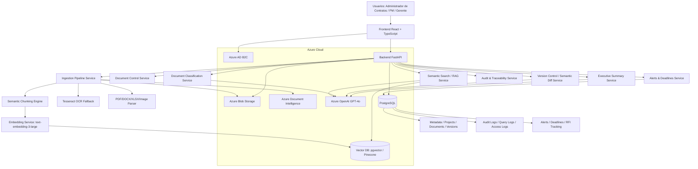
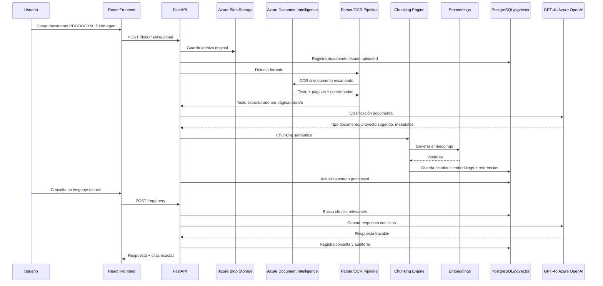
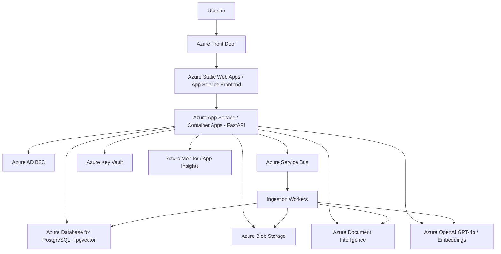
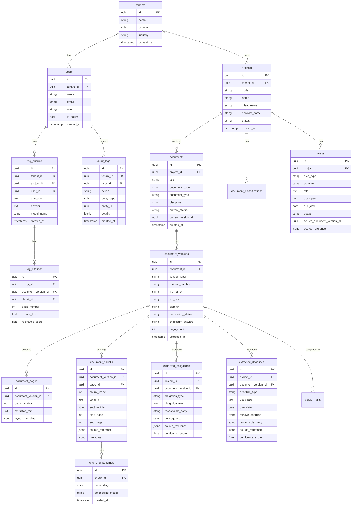
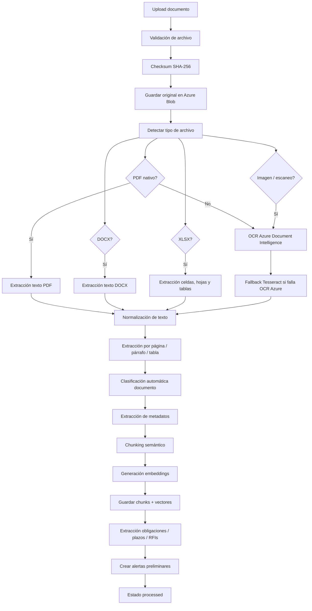
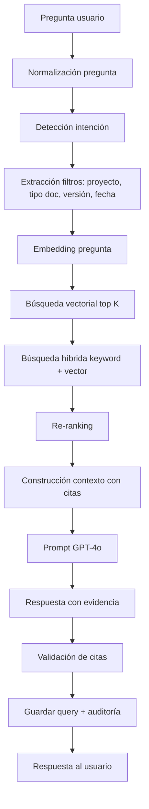

# DocuBot — Módulo 02 de Aurenza IA
## Arquitectura marco para diseño web y desarrollo MVP

**Empresa:** Aurenza Group  
**Plataforma:** Aurenza IA  
**Módulo:** 02 — DocuBot  
**Dominio:** Gestión documental con IA para minería, construcción y proyectos EPC/EPCM en Chile  
**Usuarios principales:** Administrador de Contratos, Project Manager, Gerente de Proyecto, Document Controller, Legal/Comercial  
**Stack técnico objetivo:** Python + FastAPI, React + TypeScript, Azure OpenAI GPT-4o, text-embedding-3-large, PostgreSQL/pgvector o Pinecone, Azure Blob Storage, Azure Document Intelligence, Azure AD B2C.

---

## 1. Propósito del documento

Este documento consolida las instrucciones, arquitectura, prompts, modelo de datos, endpoints, flujos de ingesta, estrategias RAG, decisiones técnicas y código base necesarios para comenzar el diseño web y desarrollo del módulo **DocuBot** dentro de la plataforma **Aurenza IA**.

Debe ser usado como documento base para:

- Diseño UX/UI en Stitch.
- Levantamiento de épicas e historias de usuario.
- Diseño técnico del backend.
- Diseño de arquitectura cloud en Azure.
- Implementación del pipeline documental con IA.
- Desarrollo del motor RAG con trazabilidad documental.
- Preparación del MVP y evolución hacia producción SaaS.

---

## 2. Contexto de negocio

**Aurenza Group** es una empresa chilena de servicios profesionales B2B orientada al staffing especializado para minería, construcción, ingeniería y proyectos EPC/EPCM.

DocuBot debe resolver un problema crítico de la industria: los proyectos mineros y de construcción operan con grandes volúmenes documentales, versiones múltiples, RFIs, actas, contratos, anexos, especificaciones, adendas y transmittals que son difíciles de consultar, comparar y controlar manualmente.

El objetivo del módulo es convertir documentos dispersos en una **base de conocimiento contractual, técnica y operacional consultable con IA**, con trazabilidad, citas exactas, control de versiones y auditoría.

---

## 3. Volumen y tipos documentales esperados

### 3.1 Volumen estimado

- 500 a 5.000 documentos por proyecto.
- Múltiples proyectos simultáneos.
- Múltiples usuarios consultando documentos en paralelo.
- Documentos con múltiples revisiones y versiones.
- Consultas frecuentes por lenguaje natural en español.

### 3.2 Tipos documentales

- Contratos.
- Adendas.
- RFIs.
- Transmittals.
- Actas de reunión.
- Especificaciones técnicas.
- Bases técnicas.
- Bases administrativas.
- Planos.
- Cronogramas.
- Propuestas técnicas.
- Propuestas comerciales.
- Órdenes de cambio.
- Cartas contractuales.
- Informes.
- Imágenes escaneadas.
- Planillas XLSX.

### 3.3 Formatos soportados

- PDF nativo.
- PDF escaneado.
- DOCX.
- XLSX.
- PNG.
- JPG/JPEG.
- TIFF.

---

## 4. Capacidades requeridas

DocuBot debe permitir:

1. Ingesta multiformato con OCR mediante Azure Document Intelligence y fallback con Tesseract.
2. Extracción estructurada de texto por documento, página, párrafo, tabla y sección.
3. Chunking semántico orientado a documentos contractuales y técnicos.
4. Generación de embeddings con `text-embedding-3-large`.
5. Almacenamiento vectorial en pgvector o Pinecone.
6. Pipeline RAG con citas exactas: documento, revisión, página, párrafo y cita textual.
7. Clasificación automática por tipo documental, disciplina, proyecto y fase.
8. Control de versiones y diff semántico entre revisiones.
9. Alertas automáticas por vencimientos, RFIs sin respuesta y obligaciones críticas.
10. Motor de búsqueda semántica en lenguaje natural en español.
11. Generación de resúmenes ejecutivos de contratos.
12. Trazabilidad de quién consultó qué, cuándo, desde qué proyecto y con qué respuesta.
13. Auditoría de consultas IA, descargas y cambios documentales.

---

## 5. Visión funcional del producto

DocuBot debe comportarse como un **copiloto documental experto en contratos mineros y construcción**, no como un simple chatbot.

Debe ser capaz de:

- Responder preguntas contractuales con evidencia.
- Buscar obligaciones en miles de documentos.
- Detectar vencimientos y plazos críticos.
- Advertir contradicciones entre contrato base y adendas.
- Comparar revisiones documentales.
- Generar resúmenes ejecutivos.
- Clasificar documentos automáticamente.
- Registrar trazabilidad completa.
- Permitir revisión humana antes de usar resultados en decisiones contractuales.

---

## 6. Usuarios y necesidades

| Usuario | Necesidad principal |
|---|---|
| Administrador de Contratos | Consultar obligaciones, plazos, adendas, claims, RFIs, penalidades y condiciones contractuales. |
| Project Manager | Conocer riesgos, vencimientos, entregables, restricciones y compromisos del proyecto. |
| Gerente de Proyecto | Recibir resúmenes ejecutivos, alertas críticas y exposición contractual. |
| Document Controller | Clasificar, cargar, versionar y controlar documentos. |
| Legal / Comercial | Analizar cambios de contrato, riesgos, reclamos, controversias y obligaciones sensibles. |
| Auditor | Revisar trazabilidad de consultas, accesos y decisiones documentales. |

---

## 7. Arquitectura general de componentes



---

## 8. Flujo de datos principal



---

## 9. Arquitectura cloud recomendada en Azure



---

## 10. Componentes backend

| Servicio | Responsabilidad |
|---|---|
| Auth Middleware | Validar JWT emitido por Azure AD B2C. |
| Document Service | Gestionar documentos, metadatos, revisiones y versiones. |
| Ingestion Service | Orquestar validación, OCR, parsing, chunking y embeddings. |
| OCR Service | Ejecutar Azure Document Intelligence y fallback Tesseract. |
| Parser Service | Extraer contenido desde PDF, DOCX, XLSX e imágenes. |
| Classification Service | Clasificar documentos por tipo, disciplina y fase. |
| Chunking Service | Dividir contenido en fragmentos semánticos. |
| Embedding Service | Generar vectores con text-embedding-3-large. |
| RAG Service | Recuperar contexto y generar respuestas con citas. |
| Versioning Service | Comparar versiones y detectar cambios semánticos. |
| Alerts Service | Generar y administrar alertas contractuales. |
| Summary Service | Generar resúmenes ejecutivos. |
| Audit Service | Registrar trazabilidad de uso, consultas, accesos y cambios. |

---

## 11. Componentes frontend

### 11.1 Stack recomendado

- React + TypeScript.
- Vite o Next.js.
- shadcn/ui o Material UI.
- TanStack Query.
- TanStack Table.
- React Hook Form + Zod.
- MSAL React para Azure AD B2C.
- react-pdf para visor documental.
- Uppy o react-dropzone para carga masiva.
- Recharts para métricas.

### 11.2 Pantallas principales

1. Login.
2. Dashboard general DocuBot.
3. Gestión de proyectos.
4. Biblioteca documental.
5. Carga masiva de documentos.
6. Estado de procesamiento.
7. Buscador inteligente.
8. Respuesta RAG con citas.
9. Resumen ejecutivo de contrato.
10. Comparador de versiones.
11. Panel de alertas.
12. Auditoría de consultas.
13. Configuración de usuarios y roles.

---

## 12. Diseño UX/UI sugerido para Stitch

### 12.1 Estilo visual

- Estilo corporativo SaaS B2B.
- Diseño limpio, ejecutivo y técnico.
- Paleta sobria: azul petróleo, gris grafito, blanco, celeste tecnológico y acentos verdes para estados correctos.
- Interfaz orientada a gerentes, administradores de contrato y equipos técnicos.
- Debe comunicar seguridad, trazabilidad, precisión y control documental.

### 12.2 Principios de diseño

- Mostrar evidencia antes que opiniones.
- Citas visibles y auditables.
- Estado documental siempre claro.
- Alertas destacadas por criticidad.
- Respuestas IA marcadas como preliminares si requieren revisión humana.
- Comparaciones de versiones con impacto contractual visible.
- Navegación por proyecto, tipo documental y revisión.

### 12.3 Dashboard principal

Debe contener:

- Total de documentos cargados.
- Documentos procesados.
- Documentos con error.
- Alertas críticas.
- RFIs sin respuesta.
- Documentos recientes.
- Consultas frecuentes.
- Proyectos activos.
- Costo estimado IA del mes.
- Usuarios activos.

### 12.4 Biblioteca documental

Debe permitir:

- Tabla de documentos.
- Filtros por proyecto.
- Filtros por tipo documental.
- Filtros por disciplina.
- Filtros por revisión.
- Estado de procesamiento.
- Botón para ver documento.
- Botón para consultar documento.
- Botón para comparar versiones.
- Historial de revisiones.

### 12.5 Buscador inteligente

Debe mostrar:

- Caja de pregunta en lenguaje natural.
- Selector de proyecto.
- Filtros por tipo documental.
- Filtros por revisión vigente o todas las revisiones.
- Respuesta ejecutiva.
- Citas exactas.
- Nivel de confianza.
- Advertencias.
- Botón “requiere revisión humana”.
- Botón “generar resumen ejecutivo”.

### 12.6 Comparador de versiones

Debe mostrar:

- Versión anterior.
- Versión nueva.
- Cambios textuales.
- Cambios semánticos.
- Cambios críticos.
- Impacto contractual.
- Impacto comercial.
- Impacto técnico.
- Plazos modificados.
- Obligaciones nuevas o eliminadas.
- Recomendación de acción.

---

## 13. Modelo de datos conceptual



---

## 14. SQL base

### 14.1 Extensiones

```sql
CREATE EXTENSION IF NOT EXISTS "uuid-ossp";
CREATE EXTENSION IF NOT EXISTS vector;
CREATE EXTENSION IF NOT EXISTS pg_trgm;
```

### 14.2 Tablas principales

```sql
CREATE TABLE tenants (
    id UUID PRIMARY KEY DEFAULT uuid_generate_v4(),
    name VARCHAR(255) NOT NULL,
    country VARCHAR(100) DEFAULT 'Chile',
    industry VARCHAR(150),
    created_at TIMESTAMP DEFAULT NOW()
);

CREATE TABLE users (
    id UUID PRIMARY KEY DEFAULT uuid_generate_v4(),
    tenant_id UUID NOT NULL REFERENCES tenants(id),
    name VARCHAR(255) NOT NULL,
    email VARCHAR(255) UNIQUE NOT NULL,
    role VARCHAR(80) NOT NULL,
    azure_b2c_subject VARCHAR(255),
    is_active BOOLEAN DEFAULT TRUE,
    created_at TIMESTAMP DEFAULT NOW()
);

CREATE TABLE projects (
    id UUID PRIMARY KEY DEFAULT uuid_generate_v4(),
    tenant_id UUID NOT NULL REFERENCES tenants(id),
    code VARCHAR(100),
    name VARCHAR(255) NOT NULL,
    client_name VARCHAR(255),
    contract_name VARCHAR(255),
    status VARCHAR(50) DEFAULT 'active',
    created_at TIMESTAMP DEFAULT NOW()
);

CREATE TABLE documents (
    id UUID PRIMARY KEY DEFAULT uuid_generate_v4(),
    project_id UUID NOT NULL REFERENCES projects(id),
    title VARCHAR(500) NOT NULL,
    document_code VARCHAR(150),
    document_type VARCHAR(100),
    discipline VARCHAR(100),
    current_status VARCHAR(80) DEFAULT 'active',
    current_version_id UUID,
    created_at TIMESTAMP DEFAULT NOW()
);

CREATE TABLE document_versions (
    id UUID PRIMARY KEY DEFAULT uuid_generate_v4(),
    document_id UUID NOT NULL REFERENCES documents(id),
    version_label VARCHAR(80),
    revision_number VARCHAR(80),
    file_name VARCHAR(500) NOT NULL,
    file_type VARCHAR(30) NOT NULL,
    blob_url TEXT NOT NULL,
    processing_status VARCHAR(80) DEFAULT 'uploaded',
    checksum_sha256 VARCHAR(128),
    page_count INTEGER,
    uploaded_by UUID REFERENCES users(id),
    uploaded_at TIMESTAMP DEFAULT NOW()
);

ALTER TABLE documents
ADD CONSTRAINT fk_current_version
FOREIGN KEY (current_version_id)
REFERENCES document_versions(id);

CREATE TABLE document_pages (
    id UUID PRIMARY KEY DEFAULT uuid_generate_v4(),
    document_version_id UUID NOT NULL REFERENCES document_versions(id),
    page_number INTEGER NOT NULL,
    extracted_text TEXT,
    layout_metadata JSONB,
    created_at TIMESTAMP DEFAULT NOW(),
    UNIQUE(document_version_id, page_number)
);

CREATE TABLE document_chunks (
    id UUID PRIMARY KEY DEFAULT uuid_generate_v4(),
    document_version_id UUID NOT NULL REFERENCES document_versions(id),
    page_id UUID REFERENCES document_pages(id),
    chunk_index INTEGER NOT NULL,
    content TEXT NOT NULL,
    section_title VARCHAR(500),
    start_page INTEGER,
    end_page INTEGER,
    token_count INTEGER,
    source_reference JSONB,
    metadata JSONB,
    created_at TIMESTAMP DEFAULT NOW(),
    UNIQUE(document_version_id, chunk_index)
);

CREATE TABLE chunk_embeddings (
    id UUID PRIMARY KEY DEFAULT uuid_generate_v4(),
    chunk_id UUID NOT NULL REFERENCES document_chunks(id) ON DELETE CASCADE,
    embedding VECTOR(3072),
    embedding_model VARCHAR(100) DEFAULT 'text-embedding-3-large',
    created_at TIMESTAMP DEFAULT NOW()
);
```

### 14.3 Obligaciones, plazos y alertas

```sql
CREATE TABLE extracted_obligations (
    id UUID PRIMARY KEY DEFAULT uuid_generate_v4(),
    project_id UUID NOT NULL REFERENCES projects(id),
    document_version_id UUID NOT NULL REFERENCES document_versions(id),
    obligation_type VARCHAR(120),
    obligation_text TEXT NOT NULL,
    responsible_party VARCHAR(255),
    consequence TEXT,
    source_reference JSONB,
    confidence_score NUMERIC(5,2),
    created_at TIMESTAMP DEFAULT NOW()
);

CREATE TABLE extracted_deadlines (
    id UUID PRIMARY KEY DEFAULT uuid_generate_v4(),
    project_id UUID NOT NULL REFERENCES projects(id),
    document_version_id UUID NOT NULL REFERENCES document_versions(id),
    deadline_type VARCHAR(120),
    description TEXT NOT NULL,
    due_date DATE,
    relative_deadline VARCHAR(255),
    responsible_party VARCHAR(255),
    source_reference JSONB,
    confidence_score NUMERIC(5,2),
    created_at TIMESTAMP DEFAULT NOW()
);

CREATE TABLE alerts (
    id UUID PRIMARY KEY DEFAULT uuid_generate_v4(),
    project_id UUID NOT NULL REFERENCES projects(id),
    alert_type VARCHAR(100) NOT NULL,
    severity VARCHAR(50) DEFAULT 'medium',
    title VARCHAR(500) NOT NULL,
    description TEXT,
    due_date DATE,
    status VARCHAR(50) DEFAULT 'open',
    source_document_version_id UUID REFERENCES document_versions(id),
    source_reference JSONB,
    created_at TIMESTAMP DEFAULT NOW(),
    resolved_at TIMESTAMP
);
```

### 14.4 RAG y auditoría

```sql
CREATE TABLE rag_queries (
    id UUID PRIMARY KEY DEFAULT uuid_generate_v4(),
    tenant_id UUID NOT NULL REFERENCES tenants(id),
    project_id UUID REFERENCES projects(id),
    user_id UUID NOT NULL REFERENCES users(id),
    question TEXT NOT NULL,
    answer TEXT,
    model_name VARCHAR(100),
    retrieval_k INTEGER DEFAULT 8,
    latency_ms INTEGER,
    created_at TIMESTAMP DEFAULT NOW()
);

CREATE TABLE rag_citations (
    id UUID PRIMARY KEY DEFAULT uuid_generate_v4(),
    query_id UUID NOT NULL REFERENCES rag_queries(id) ON DELETE CASCADE,
    document_version_id UUID NOT NULL REFERENCES document_versions(id),
    chunk_id UUID REFERENCES document_chunks(id),
    page_number INTEGER,
    quoted_text TEXT,
    relevance_score NUMERIC(8,5),
    source_reference JSONB,
    created_at TIMESTAMP DEFAULT NOW()
);

CREATE TABLE audit_logs (
    id UUID PRIMARY KEY DEFAULT uuid_generate_v4(),
    tenant_id UUID NOT NULL REFERENCES tenants(id),
    user_id UUID REFERENCES users(id),
    action VARCHAR(150) NOT NULL,
    entity_type VARCHAR(100),
    entity_id UUID,
    details JSONB,
    ip_address VARCHAR(100),
    user_agent TEXT,
    created_at TIMESTAMP DEFAULT NOW()
);
```

### 14.5 Diff semántico

```sql
CREATE TABLE version_diffs (
    id UUID PRIMARY KEY DEFAULT uuid_generate_v4(),
    document_id UUID NOT NULL REFERENCES documents(id),
    previous_version_id UUID NOT NULL REFERENCES document_versions(id),
    new_version_id UUID NOT NULL REFERENCES document_versions(id),
    diff_type VARCHAR(100),
    semantic_summary TEXT,
    critical_changes JSONB,
    obligations_changed JSONB,
    deadlines_changed JSONB,
    risk_level VARCHAR(50),
    created_at TIMESTAMP DEFAULT NOW()
);
```

### 14.6 Índices recomendados

```sql
CREATE INDEX idx_projects_tenant_id ON projects(tenant_id);
CREATE INDEX idx_documents_project_id ON documents(project_id);
CREATE INDEX idx_documents_type ON documents(document_type);
CREATE INDEX idx_document_versions_document_id ON document_versions(document_id);
CREATE INDEX idx_document_chunks_version ON document_chunks(document_version_id);
CREATE INDEX idx_document_chunks_content_trgm ON document_chunks USING gin (content gin_trgm_ops);
CREATE INDEX idx_alerts_project_due_date ON alerts(project_id, due_date);
CREATE INDEX idx_alerts_status ON alerts(status);
CREATE INDEX idx_rag_queries_project_user ON rag_queries(project_id, user_id);
CREATE INDEX idx_audit_logs_tenant_user ON audit_logs(tenant_id, user_id);

CREATE INDEX idx_chunk_embeddings_vector
ON chunk_embeddings
USING ivfflat (embedding vector_cosine_ops)
WITH (lists = 100);
```

---

## 15. API endpoints principales

### 15.1 Crear proyecto

```http
POST /api/v1/projects
```

Request:

```json
{
  "code": "MLP-STF-2026-001",
  "name": "Servicio de Staffing Proyecto Minero",
  "client_name": "Minera Los Pelambres",
  "contract_name": "Contrato Servicios Profesionales EPCM"
}
```

Response:

```json
{
  "project_id": "9d99b226-7ab0-4f8b-a8e1-9d92cfd82381",
  "status": "active",
  "message": "Proyecto creado correctamente."
}
```

### 15.2 Cargar documento

```http
POST /api/v1/projects/{project_id}/documents/upload
```

Request multipart:

```text
file: contrato_principal.pdf
document_type: contract
discipline: contractual
revision_number: Rev.0
version_label: Original
```

Response:

```json
{
  "document_id": "be8d8ac0-9e11-47b8-a11e-e7e7d354aa87",
  "document_version_id": "0f1b7fc6-3185-45f1-b947-f8108ed84daa",
  "processing_status": "uploaded",
  "message": "Documento cargado. Procesamiento iniciado."
}
```

### 15.3 Procesar documento

```http
POST /api/v1/document-versions/{document_version_id}/process
```

Response:

```json
{
  "document_version_id": "0f1b7fc6-3185-45f1-b947-f8108ed84daa",
  "status": "processing",
  "steps": [
    "file_validation",
    "ocr",
    "text_extraction",
    "classification",
    "chunking",
    "embeddings",
    "metadata_extraction"
  ]
}
```

### 15.4 Consulta RAG

```http
POST /api/v1/rag/query
```

Request:

```json
{
  "project_id": "9d99b226-7ab0-4f8b-a8e1-9d92cfd82381",
  "question": "¿Cuáles son los plazos de respuesta para RFIs y qué consecuencias existen si el contratista no cumple?",
  "filters": {
    "document_types": ["contract", "rfi", "technical_specification"],
    "revision_policy": "latest_only"
  },
  "top_k": 8
}
```

Response:

```json
{
  "query_id": "d0999643-d51a-429b-a37c-7a1d87c53755",
  "answer": "Según los documentos revisados, el plazo de respuesta para RFIs es de 5 días hábiles desde su recepción formal. En caso de incumplimiento, el contratista debe escalar la consulta al Administrador de Contrato y dejar constancia en el registro de comunicaciones. No se identificó una multa específica asociada exclusivamente a RFIs, por lo que se recomienda revisión contractual humana.",
  "confidence": 0.84,
  "citations": [
    {
      "document_title": "Contrato Servicios Profesionales EPCM",
      "revision": "Rev.0",
      "page": 34,
      "paragraph": "Cláusula 12.4",
      "quote": "Las consultas técnicas deberán ser respondidas dentro de un plazo máximo de cinco días hábiles..."
    },
    {
      "document_title": "Procedimiento de Comunicaciones del Proyecto",
      "revision": "Rev.1",
      "page": 8,
      "paragraph": "Sección 4.2",
      "quote": "Toda RFI no respondida dentro del plazo deberá ser escalada al Administrador de Contrato..."
    }
  ],
  "warnings": [
    "No se encontró una penalidad económica explícita asociada al incumplimiento de respuesta de RFIs."
  ]
}
```

### 15.5 Clasificación documental

```http
POST /api/v1/document-versions/{document_version_id}/classify
```

Response:

```json
{
  "document_version_id": "0f1b7fc6-3185-45f1-b947-f8108ed84daa",
  "classification": {
    "document_type": "contract",
    "discipline": "contractual",
    "project_phase": "execution",
    "confidence_score": 0.91
  },
  "suggested_metadata": {
    "contract_number": "CT-2026-0045",
    "client_name": "Minera Los Pelambres",
    "contractor_name": "Aurenza Group",
    "effective_date": "2026-06-01"
  }
}
```

### 15.6 Resumen ejecutivo

```http
POST /api/v1/document-versions/{document_version_id}/executive-summary
```

Request:

```json
{
  "summary_type": "contractual",
  "audience": "gerente_proyecto",
  "include_risks": true,
  "include_deadlines": true,
  "include_obligations": true
}
```

Response:

```json
{
  "document_version_id": "0f1b7fc6-3185-45f1-b947-f8108ed84daa",
  "summary": {
    "executive_overview": "El contrato establece obligaciones de provisión de profesionales especializados para apoyo en gestión EPCM...",
    "key_obligations": [
      "Mantener dotación profesional mínima aprobada por el mandante.",
      "Cumplir plazos de reemplazo de personal crítico.",
      "Reportar avances y desempeño mensualmente."
    ],
    "critical_deadlines": [
      {
        "description": "Entrega de plan de movilización",
        "deadline": "10 días desde adjudicación"
      }
    ],
    "risks": [
      {
        "risk": "Demora en aprobación de profesionales clave",
        "impact": "Puede retrasar la movilización del equipo base."
      }
    ]
  }
}
```

### 15.7 Comparación de versiones

```http
POST /api/v1/documents/{document_id}/compare
```

Request:

```json
{
  "previous_version_id": "v1",
  "new_version_id": "v2",
  "comparison_level": "semantic"
}
```

Response:

```json
{
  "document_id": "be8d8ac0-9e11-47b8-a11e-e7e7d354aa87",
  "risk_level": "high",
  "semantic_summary": "La nueva versión modifica plazos de entrega, incrementa obligaciones de reporte y agrega una cláusula de penalidad por atraso.",
  "critical_changes": [
    {
      "type": "deadline_changed",
      "previous": "10 días corridos",
      "new": "5 días hábiles",
      "impact": "Reduce ventana de cumplimiento del contratista."
    },
    {
      "type": "new_penalty",
      "previous": "No existía penalidad explícita.",
      "new": "Multa de 0,5% del monto mensual por día de atraso.",
      "impact": "Aumenta exposición comercial."
    }
  ]
}
```

### 15.8 Consultar alertas

```http
GET /api/v1/projects/{project_id}/alerts?status=open
```

Response:

```json
{
  "project_id": "9d99b226-7ab0-4f8b-a8e1-9d92cfd82381",
  "alerts": [
    {
      "alert_id": "abf1d6f5-2cb5-4e24-b76a-d92b8c4f1f30",
      "alert_type": "deadline",
      "severity": "high",
      "title": "RFI sin respuesta próxima a vencer",
      "description": "La RFI-024 debe ser respondida dentro de las próximas 24 horas.",
      "due_date": "2026-06-12",
      "status": "open"
    }
  ]
}
```

---

## 16. Pipeline de ingesta documental



### 16.1 Pasos detallados

1. Validar archivo, extensión, tamaño, usuario, tenant y proyecto.
2. Calcular hash SHA-256 para detectar duplicados.
3. Guardar el archivo original en Azure Blob Storage.
4. Registrar documento y versión en PostgreSQL.
5. Detectar tipo de archivo.
6. Extraer texto directamente o vía OCR.
7. Normalizar texto.
8. Separar por página, párrafo, tabla y sección.
9. Clasificar documento.
10. Extraer metadatos.
11. Aplicar chunking semántico.
12. Generar embeddings.
13. Guardar chunks y vectores.
14. Extraer obligaciones, plazos y alertas.
15. Actualizar estado a `processed`.

### 16.2 Ruta de Azure Blob sugerida

```text
/{tenant_id}/{project_id}/{document_id}/{version_id}/original/{filename}
```

---

## 17. Clasificación documental

### 17.1 Categorías iniciales

| Código | Tipo documental |
|---|---|
| contract | Contrato |
| addendum | Adenda |
| rfi | RFI |
| transmittal | Transmittal |
| meeting_minutes | Acta |
| technical_specification | Especificación técnica |
| drawing | Plano |
| schedule | Cronograma |
| commercial_proposal | Propuesta comercial |
| technical_proposal | Propuesta técnica |
| purchase_order | Orden de compra |
| change_order | Orden de cambio |
| claim | Reclamo |
| letter | Carta |
| report | Informe |
| other | Otro |

### 17.2 Disciplinas

- Contractual.
- Comercial.
- Ingeniería.
- Construcción.
- Procurement.
- Seguridad.
- Medio ambiente.
- Calidad.
- Planificación.
- Operaciones.
- Legal.
- Otra.

---

## 18. Estrategia de chunking y embeddings

### 18.1 Principio rector

El chunking no debe ser solamente por tokens. En documentos contractuales y técnicos debe respetar la estructura del documento: cláusulas, secciones, numerales, tablas, anexos y páginas.

### 18.2 Estrategia recomendada

Prioridad de segmentación:

1. Título o sección.
2. Cláusula.
3. Numeral.
4. Párrafo.
5. Tabla.
6. Página.
7. Límite de tokens.

### 18.3 Tamaños recomendados

| Tipo documento | Chunk recomendado | Overlap |
|---|---:|---:|
| Contratos | 700-1.200 tokens | 120-180 tokens |
| Adendas | 500-900 tokens | 100-150 tokens |
| RFIs | Documento completo si es corto | 50-100 tokens |
| Actas | Por acuerdo o tema | 100 tokens |
| Especificaciones técnicas | 800-1.500 tokens | 150-250 tokens |
| Planos | OCR + metadatos + notas | Variable |
| XLSX | Por hoja, tabla o rango | Variable |

### 18.4 Metadata mínima por chunk

```json
{
  "tenant_id": "uuid",
  "project_id": "uuid",
  "document_id": "uuid",
  "document_version_id": "uuid",
  "document_title": "Contrato Servicios EPCM",
  "document_type": "contract",
  "revision_number": "Rev.0",
  "page_start": 12,
  "page_end": 13,
  "section_title": "Cláusula 8 - Plazos",
  "paragraph_number": "8.3",
  "discipline": "contractual",
  "source_path": "azure_blob_url",
  "checksum_sha256": "..."
}
```

### 18.5 Ejemplo de chunk

```json
{
  "chunk_id": "chunk-00124",
  "content": "8.3 Plazo de respuesta a RFIs. El Mandante deberá responder las consultas técnicas dentro de un plazo máximo de cinco días hábiles...",
  "source_reference": {
    "document": "Contrato Servicios Profesionales EPCM",
    "revision": "Rev.0",
    "page": 34,
    "paragraph": "8.3",
    "section": "Plazo de respuesta a RFIs"
  }
}
```

---

## 19. Pipeline RAG contractual



### 19.1 Estrategia de recuperación

Usar búsqueda híbrida:

1. Vector search para similitud semántica.
2. Keyword search para cláusulas, códigos, siglas, números de RFIs, documentos y nombres técnicos.
3. Metadata filters por proyecto, tipo de documento, revisión, disciplina y fecha.
4. Re-ranking de resultados.
5. Respuesta obligatoria con citas.

### 19.2 Política de citas

Cada afirmación contractual relevante debe citar:

- Documento.
- Revisión.
- Página.
- Párrafo o sección.
- Cita textual.
- Nivel de confianza.

Sin cita suficiente, DocuBot debe responder: “No existe evidencia suficiente en los documentos revisados”.

---

## 20. Prompt RAG contractual

### 20.1 System prompt

```text
Eres DocuBot, un asistente experto en administración contractual, gestión documental, minería, construcción, proyectos EPC/EPCM, control de documentos, RFIs, transmittals, adendas, contratos y especificaciones técnicas.

Tu tarea es responder consultas del usuario usando exclusivamente el contexto documental recuperado desde la base de conocimiento del proyecto.

Reglas obligatorias:

1. No inventes información.
2. No uses conocimiento externo si no está respaldado por los documentos entregados en el contexto.
3. Toda afirmación contractual relevante debe tener una cita.
4. Cada cita debe indicar documento, revisión, página, párrafo o sección.
5. Si los documentos no contienen evidencia suficiente, debes decirlo claramente.
6. Si existen contradicciones entre documentos, debes indicarlo y priorizar:
   a. La versión documental más reciente.
   b. La adenda sobre el contrato base.
   c. El contrato sobre documentos operacionales.
   d. Las especificaciones técnicas sobre documentos secundarios, cuando la consulta sea técnica.
7. Si una respuesta implica riesgo contractual, debes marcarla como "requiere revisión humana".
8. Si detectas un plazo, vencimiento, multa, obligación o condición sensible, debes destacarlo.
9. Responde en español claro, profesional y ejecutivo.
10. Nunca entregues una respuesta sin separar evidencia documental de interpretación.

Formato de respuesta obligatorio:

{
  "answer": "Respuesta directa y ejecutiva.",
  "evidence": [
    {
      "document": "",
      "revision": "",
      "page": "",
      "paragraph": "",
      "quote": ""
    }
  ],
  "interpretation": "Interpretación contractual basada en la evidencia.",
  "risks_or_warnings": [
    ""
  ],
  "confidence": 0.0,
  "requires_human_review": true
}
```

### 20.2 Human prompt

```text
Pregunta del usuario:
{question}

Proyecto:
{project_name}

Contexto documental recuperado:
{retrieved_context}

Instrucciones:
- Responde solamente con base en el contexto entregado.
- Incluye citas exactas.
- Si la evidencia no es suficiente, indícalo.
- Si hay documentos con distintas revisiones, prioriza la revisión más reciente.
- Si hay adendas, analiza si modifican el contrato base.
- Devuelve exclusivamente JSON válido.
```

### 20.3 Ejemplo de respuesta esperada

```json
{
  "answer": "El contratista debe responder los RFIs dentro de un plazo máximo de 5 días hábiles desde su recepción formal.",
  "evidence": [
    {
      "document": "Contrato Servicios Profesionales EPCM",
      "revision": "Rev.0",
      "page": "34",
      "paragraph": "Cláusula 12.4",
      "quote": "Las consultas técnicas deberán ser respondidas dentro de un plazo máximo de cinco días hábiles..."
    }
  ],
  "interpretation": "El plazo opera desde la recepción formal del RFI. Si el documento no define penalidad directa, debe revisarse junto con las cláusulas generales de incumplimiento.",
  "risks_or_warnings": [
    "No se encontró una penalidad específica asociada exclusivamente a RFIs.",
    "Requiere revisión humana si el plazo está vinculado a hitos críticos del proyecto."
  ],
  "confidence": 0.87,
  "requires_human_review": true
}
```

---

## 21. Prompt de clasificación documental

```text
Eres un clasificador documental experto en proyectos mineros, construcción industrial, contratos EPC, EPCM, ingeniería, abastecimiento y administración contractual.

Analiza el texto del documento y clasifícalo según:

1. Tipo documental:
- contract
- addendum
- rfi
- transmittal
- meeting_minutes
- technical_specification
- drawing
- schedule
- commercial_proposal
- technical_proposal
- purchase_order
- change_order
- claim
- letter
- report
- other

2. Disciplina:
- contractual
- commercial
- engineering
- construction
- procurement
- safety
- environmental
- quality
- planning
- operations
- legal
- other

3. Fase del proyecto:
- tender
- award
- mobilization
- execution
- commissioning
- closeout
- dispute
- unknown

4. Metadatos relevantes:
- nombre del contrato
- mandante
- contratista
- número de contrato
- código de documento
- revisión
- fecha
- asunto principal
- responsables mencionados

Devuelve solo JSON válido con este formato:

{
  "document_type": "",
  "discipline": "",
  "project_phase": "",
  "detected_metadata": {
    "contract_name": "",
    "owner": "",
    "contractor": "",
    "contract_number": "",
    "document_code": "",
    "revision": "",
    "date": "",
    "subject": "",
    "mentioned_responsibles": []
  },
  "confidence_score": 0.0,
  "classification_reason": "",
  "requires_human_validation": true
}
```

---

## 22. Prompt de extracción de obligaciones, plazos y alertas

```text
Eres un analista senior de administración contractual para minería y construcción.

Analiza el contexto documental y extrae obligaciones, plazos, vencimientos, multas, RFIs pendientes, entregables críticos y condiciones que puedan generar alertas contractuales.

No inventes datos. Si una fecha es relativa, consérvala como plazo relativo y no la conviertas a fecha absoluta salvo que exista una fecha base en el contexto.

Devuelve solo JSON válido:

{
  "obligations": [
    {
      "obligation_type": "",
      "description": "",
      "responsible_party": "",
      "consequence": "",
      "source_reference": {
        "document": "",
        "revision": "",
        "page": "",
        "paragraph": "",
        "quote": ""
      },
      "confidence": 0.0
    }
  ],
  "deadlines": [
    {
      "deadline_type": "",
      "description": "",
      "due_date": "",
      "relative_deadline": "",
      "responsible_party": "",
      "source_reference": {
        "document": "",
        "revision": "",
        "page": "",
        "paragraph": "",
        "quote": ""
      },
      "confidence": 0.0
    }
  ],
  "alerts": [
    {
      "alert_type": "deadline|rfi|obligation|penalty|missing_response|document_review",
      "severity": "low|medium|high|critical",
      "title": "",
      "description": "",
      "recommended_action": "",
      "source_reference": {
        "document": "",
        "revision": "",
        "page": "",
        "paragraph": "",
        "quote": ""
      }
    }
  ],
  "warnings": [
    ""
  ]
}
```

---

## 23. Prompt de diff semántico

```text
Eres un especialista en análisis contractual y control de cambios documentales para proyectos mineros, construcción y EPC/EPCM.

Compara la versión anterior y la nueva versión del documento.

Tu objetivo es detectar cambios semánticos relevantes, no solo diferencias textuales.

Debes identificar:
- Cambios de obligaciones
- Cambios de plazos
- Cambios de multas
- Cambios de responsabilidades
- Cambios de alcance
- Cambios de condiciones técnicas
- Cambios de condiciones comerciales
- Cambios de riesgos contractuales

Clasifica cada cambio según impacto:
- low
- medium
- high
- critical

Devuelve solo JSON válido:

{
  "semantic_summary": "",
  "risk_level": "low|medium|high|critical",
  "critical_changes": [
    {
      "change_type": "",
      "previous_text": "",
      "new_text": "",
      "semantic_impact": "",
      "risk_level": "",
      "recommended_action": "",
      "source_reference_previous": {
        "page": "",
        "paragraph": ""
      },
      "source_reference_new": {
        "page": "",
        "paragraph": ""
      }
    }
  ],
  "obligations_changed": [],
  "deadlines_changed": [],
  "commercial_impacts": [],
  "technical_impacts": [],
  "requires_legal_review": true
}
```

---

## 24. Control de versiones

### 24.1 Objetivo

Comparar revisiones de un mismo documento y detectar cambios con impacto contractual, comercial, técnico o de plazo.

### 24.2 Tipos de cambios críticos

| Tipo de cambio | Ejemplo |
|---|---|
| Cambio de plazo | 10 días corridos a 5 días hábiles. |
| Nueva obligación | Se agrega reporte semanal. |
| Eliminación de obligación | Se elimina exigencia de certificación. |
| Cambio de responsable | Contratista a Mandante. |
| Nueva multa | Penalidad por atraso. |
| Cambio técnico | Nuevo estándar de ejecución. |
| Cambio de alcance | Servicio adicional. |
| Cambio comercial | Nueva tarifa, multa o condición de pago. |

---

## 25. Alertas automáticas

### 25.1 Tipos de alerta

| Tipo | Descripción |
|---|---|
| deadline | Vencimiento contractual. |
| rfi | RFI sin respuesta. |
| obligation | Obligación próxima a vencer. |
| document_review | Documento pendiente de revisión. |
| version_change | Nueva revisión con cambios críticos. |
| penalty | Posible multa o penalidad. |
| missing_document | Documento requerido no cargado. |
| claim_risk | Riesgo de reclamo contractual. |

### 25.2 Severidad

| Severidad | Criterio |
|---|---|
| low | Informativo. |
| medium | Requiere seguimiento. |
| high | Puede afectar plazo o costo. |
| critical | Riesgo contractual, comercial o legal inmediato. |

---

## 26. Seguridad y cumplimiento

### 26.1 Autenticación

Usar Azure AD B2C con:

- JWT.
- Roles.
- Multiempresa.
- MFA opcional.
- Políticas de acceso por tenant y proyecto.

### 26.2 Roles sugeridos

| Rol | Permisos |
|---|---|
| Admin Tenant | Administra empresa, usuarios y proyectos. |
| Project Manager | Administra proyecto y documentos. |
| Contract Manager | Consulta, clasifica y genera reportes. |
| Document Controller | Carga, versiona y clasifica documentos. |
| Viewer | Consulta documentos autorizados. |
| Auditor | Revisa trazabilidad y logs. |

### 26.3 Seguridad documental

- HTTPS obligatorio.
- Cifrado en reposo.
- SAS tokens de corta duración.
- Control de acceso por tenant/proyecto.
- Auditoría de descargas.
- Auditoría de consultas IA.
- Registro de prompts y respuestas.
- Redacción opcional de información sensible.

---

## 27. Observabilidad y métricas

### 27.1 Herramientas

| Necesidad | Herramienta |
|---|---|
| Logs backend | Azure Application Insights. |
| Métricas API | Azure Monitor. |
| Errores frontend | Sentry. |
| Trazas | OpenTelemetry. |
| Costos IA | Logging interno por token. |
| Auditoría negocio | PostgreSQL audit tables. |

### 27.2 Métricas clave

- Documentos procesados por proyecto.
- Tiempo promedio de OCR.
- Tiempo promedio de embedding.
- Chunks generados por documento.
- Consultas por usuario.
- Consultas sin evidencia suficiente.
- Costo por documento.
- Costo por proyecto.
- Alertas abiertas/cerradas.
- Documentos con revisión humana pendiente.

---

## 28. Código base FastAPI — endpoint de carga

```python
from fastapi import APIRouter, UploadFile, File, Form, HTTPException
from uuid import uuid4
from typing import Optional
import hashlib

router = APIRouter(prefix="/api/v1/documents", tags=["Documents"])


@router.post("/upload")
async def upload_document(
    project_id: str = Form(...),
    document_type: Optional[str] = Form(None),
    discipline: Optional[str] = Form(None),
    revision_number: Optional[str] = Form(None),
    file: UploadFile = File(...),
):
    allowed_extensions = [
        ".pdf",
        ".docx",
        ".xlsx",
        ".png",
        ".jpg",
        ".jpeg",
        ".tiff"
    ]

    file_name = file.filename
    extension = "." + file_name.split(".")[-1].lower()

    if extension not in allowed_extensions:
        raise HTTPException(
            status_code=400,
            detail="Formato no soportado para DocuBot."
        )

    file_bytes = await file.read()
    checksum = hashlib.sha256(file_bytes).hexdigest()

    document_id = str(uuid4())
    version_id = str(uuid4())

    blob_path = (
        f"projects/{project_id}/documents/"
        f"{document_id}/versions/{version_id}/original/{file_name}"
    )

    # 1. Guardar archivo en Azure Blob Storage
    # await storage_service.upload_bytes(blob_path, file_bytes)

    # 2. Registrar documento y versión en PostgreSQL
    # document = await document_repository.create(...)
    # version = await document_version_repository.create(...)

    # 3. Encolar procesamiento asíncrono
    # await ingestion_queue.enqueue(version_id)

    return {
        "document_id": document_id,
        "document_version_id": version_id,
        "file_name": file_name,
        "checksum_sha256": checksum,
        "blob_path": blob_path,
        "processing_status": "uploaded",
        "message": "Documento cargado correctamente. Procesamiento iniciado."
    }
```

---

## 29. Código base FastAPI — endpoint RAG

```python
from fastapi import APIRouter
from pydantic import BaseModel
from typing import Optional, List, Dict, Any
from uuid import uuid4

router = APIRouter(prefix="/api/v1/rag", tags=["RAG"])


class RagQueryRequest(BaseModel):
    project_id: str
    question: str
    top_k: int = 8
    filters: Optional[Dict[str, Any]] = None


class Citation(BaseModel):
    document_title: str
    revision: str
    page: int | None = None
    paragraph: str | None = None
    quote: str
    relevance_score: float


class RagQueryResponse(BaseModel):
    query_id: str
    answer: str
    confidence: float
    citations: List[Citation]
    warnings: List[str]
    requires_human_review: bool


@router.post("/query", response_model=RagQueryResponse)
async def rag_query(request: RagQueryRequest):
    query_id = str(uuid4())

    # 1. Generar embedding de la pregunta
    # query_embedding = await embedding_service.embed(request.question)

    # 2. Recuperar chunks relevantes desde pgvector/Pinecone
    # retrieved_chunks = await vector_repository.search(
    #     project_id=request.project_id,
    #     embedding=query_embedding,
    #     top_k=request.top_k,
    #     filters=request.filters
    # )

    # 3. Construir contexto con citas
    # context = rag_service.build_context(retrieved_chunks)

    # 4. Ejecutar GPT-4o con prompt RAG contractual
    # rag_answer = await rag_service.answer(
    #     question=request.question,
    #     context=context
    # )

    # 5. Guardar consulta, respuesta y citas
    # await audit_service.log_query(...)

    return RagQueryResponse(
        query_id=query_id,
        answer="Respuesta generada por DocuBot basada en evidencia documental.",
        confidence=0.85,
        citations=[
            Citation(
                document_title="Contrato Principal",
                revision="Rev.0",
                page=12,
                paragraph="Cláusula 5.2",
                quote="Texto citado desde el documento...",
                relevance_score=0.91
            )
        ],
        warnings=[
            "Respuesta preliminar. Requiere validación humana para uso contractual."
        ],
        requires_human_review=True
    )
```

---

## 30. Código base — embeddings con Azure OpenAI

```python
from openai import AzureOpenAI
import os

client = AzureOpenAI(
    api_key=os.getenv("AZURE_OPENAI_API_KEY"),
    api_version="2024-02-01",
    azure_endpoint=os.getenv("AZURE_OPENAI_ENDPOINT")
)


def generate_embedding(text: str) -> list[float]:
    response = client.embeddings.create(
        model="text-embedding-3-large",
        input=text
    )
    return response.data[0].embedding
```

---

## 31. Código base — búsqueda vectorial pgvector

```sql
SELECT
    dc.id AS chunk_id,
    dc.content,
    dc.source_reference,
    1 - (ce.embedding <=> $1::vector) AS similarity
FROM chunk_embeddings ce
JOIN document_chunks dc ON dc.id = ce.chunk_id
JOIN document_versions dv ON dv.id = dc.document_version_id
JOIN documents d ON d.id = dv.document_id
WHERE d.project_id = $2
ORDER BY ce.embedding <=> $1::vector
LIMIT 8;
```

---

## 32. Estructura del backend

```text
docubot-backend/
│
├── app/
│   ├── main.py
│   ├── api/
│   │   └── routes/
│   │       ├── documents.py
│   │       ├── rag.py
│   │       ├── alerts.py
│   │       └── projects.py
│   ├── services/
│   │   ├── storage_service.py
│   │   ├── ocr_service.py
│   │   ├── parser_service.py
│   │   ├── chunking_service.py
│   │   ├── embedding_service.py
│   │   ├── rag_service.py
│   │   ├── classification_service.py
│   │   └── audit_service.py
│   ├── db/
│   │   ├── models.py
│   │   └── session.py
│   ├── core/
│   │   ├── config.py
│   │   └── security.py
│   └── schemas/
│       ├── documents.py
│       └── rag.py
│
├── requirements.txt
└── Dockerfile
```

---

## 33. Decisión pgvector vs Pinecone

### 33.1 pgvector

Ventajas:

- Menor complejidad.
- Un solo motor con PostgreSQL.
- Mejor trazabilidad transaccional.
- Más simple para MVP.
- Buen calce con Azure Database for PostgreSQL.

Desventajas:

- Requiere tuning al escalar.
- Menos especializado que Pinecone para búsqueda vectorial masiva.

Recomendación: usar **pgvector para MVP y primera producción controlada**.

### 33.2 Pinecone

Ventajas:

- Escalabilidad vectorial dedicada.
- Mejor rendimiento para grandes volúmenes.
- Menor carga sobre PostgreSQL.
- Operación administrada.

Desventajas:

- Costo adicional.
- Mayor complejidad de integración.
- Datos vectoriales fuera de la base transaccional.

Recomendación: evaluar Pinecone cuando exista más de 1 millón de chunks, múltiples clientes concurrentes o necesidad de baja latencia sostenida.

---

## 34. Decisiones técnicas críticas

1. Usar pgvector o Pinecone.
2. Usar OCR full Azure o arquitectura híbrida Azure + Tesseract.
3. Usar búsqueda vectorial pura o búsqueda híbrida vector + keyword + metadata.
4. Definir respuestas internas como JSON estructurado.
5. Exigir revisión humana en respuestas con impacto contractual.
6. Diseñar multi-tenant desde el día uno.
7. Guardar prompts, respuestas y citas.
8. Hacer obligatorias las citas para respuestas contractuales.
9. Procesar documentos de manera asíncrona.
10. Definir límites de tamaño por documento y por proyecto.

---

## 35. Plan de implementación

### Fase 0 — Diseño técnico y preparación

Duración sugerida: 2 a 3 semanas.

Entregables:

- Arquitectura final.
- Modelo de datos.
- Diseño UX/UI.
- Backlog de producto.
- Políticas de seguridad.
- Definición de roles.
- Diseño de prompts.
- Decisión pgvector vs Pinecone.

### Fase 1 — MVP documental básico

Duración sugerida: 6 a 8 semanas.

Alcance:

- Login Azure AD B2C.
- Crear proyecto.
- Cargar documentos PDF/DOCX.
- Guardar en Azure Blob.
- Extraer texto básico.
- OCR con Azure Document Intelligence.
- Registrar documentos y versiones.
- Visualizar documentos procesados.

### Fase 2 — RAG con citas exactas

Duración sugerida: 6 a 8 semanas.

Alcance:

- Chunking semántico.
- Embeddings con text-embedding-3-large.
- pgvector.
- Búsqueda semántica.
- Prompt RAG contractual.
- Respuestas con citas.
- Registro de consultas.
- Auditoría usuario/pregunta/respuesta.

### Fase 3 — Clasificación y extracción contractual

Duración sugerida: 5 a 7 semanas.

Alcance:

- Clasificación automática.
- Extracción de metadatos.
- Extracción de obligaciones.
- Extracción de plazos.
- Extracción de RFIs.
- Identificación de multas.
- Alertas preliminares.

### Fase 4 — Control de versiones y diff semántico

Duración sugerida: 5 a 7 semanas.

Alcance:

- Versionamiento documental.
- Comparación entre revisiones.
- Diff textual.
- Diff semántico.
- Cambios críticos.
- Obligaciones modificadas.
- Plazos modificados.
- Riesgo contractual por cambio.

### Fase 5 — Producción SaaS

Duración sugerida: 8 a 12 semanas.

Alcance:

- Multi-tenant robusto.
- Roles granulares.
- Monitoreo.
- Auditoría avanzada.
- Backups.
- Escalamiento.
- Optimización de costos IA.
- Panel ejecutivo.
- Exportación de reportes.
- Hardening de seguridad.
- Pruebas de carga.
- Pruebas con 5.000 documentos por proyecto.

---

## 36. Backlog inicial recomendado

### 36.1 Épicas

1. Gestión de usuarios y autenticación.
2. Gestión de proyectos.
3. Gestión documental.
4. OCR y parsing.
5. Chunking y embeddings.
6. Motor RAG.
7. Clasificación documental.
8. Extracción contractual.
9. Alertas.
10. Versionamiento.
11. Auditoría.
12. Dashboard ejecutivo.

### 36.2 Historias MVP prioritarias

| ID | Historia |
|---|---|
| DOC-001 | Como usuario, quiero crear un proyecto documental. |
| DOC-002 | Como usuario, quiero cargar documentos PDF/DOCX. |
| DOC-003 | Como usuario, quiero ver el estado de procesamiento. |
| DOC-004 | Como usuario, quiero que el sistema extraiga texto automáticamente. |
| DOC-005 | Como usuario, quiero consultar documentos en lenguaje natural. |
| DOC-006 | Como usuario, quiero recibir respuestas con citas. |
| DOC-007 | Como usuario, quiero filtrar documentos por tipo. |
| DOC-008 | Como usuario, quiero ver quién consultó información sensible. |
| DOC-009 | Como usuario, quiero recibir alertas de vencimientos. |
| DOC-010 | Como usuario, quiero comparar versiones de un documento. |

---

## 37. Instrucción principal para Stitch

Diseña una aplicación SaaS B2B llamada **DocuBot**, módulo documental de **Aurenza IA**, para empresas de minería, construcción y proyectos EPC/EPCM en Chile.

La aplicación debe tener una interfaz moderna, ejecutiva y técnica, orientada a Administradores de Contrato, Project Managers y Gerentes de Proyecto. Debe permitir cargar documentos contractuales y técnicos, clasificarlos automáticamente, procesarlos con OCR, consultarlos con IA en lenguaje natural, mostrar respuestas con citas exactas, comparar versiones y generar alertas contractuales.

### Pantallas requeridas para el diseño

1. Login corporativo.
2. Dashboard principal.
3. Vista de proyectos.
4. Biblioteca documental.
5. Carga masiva de documentos.
6. Estado de procesamiento documental.
7. Buscador inteligente con IA.
8. Vista de respuesta con citas.
9. Comparador de versiones.
10. Panel de alertas.
11. Resumen ejecutivo de contrato.
12. Auditoría de consultas.
13. Configuración de usuarios y roles.

### Elementos visuales claves

- Tarjetas KPI.
- Tabla documental avanzada.
- Filtros por proyecto, tipo documental, disciplina y revisión.
- Visor PDF con citas resaltadas.
- Panel lateral de evidencia documental.
- Semáforo de alertas.
- Gráfico de documentos procesados.
- Timeline de versiones.
- Panel de cambios críticos.
- Chat/consulta IA profesional con respuesta estructurada.

### Tono visual

- Profesional.
- Seguro.
- Corporativo.
- Técnico.
- Confiable.
- Orientado a trazabilidad.
- Adecuado para minería y construcción industrial.

---

## 38. Recomendación final

DocuBot debe construirse como una plataforma de **gestión documental inteligente y trazable**, no como un chatbot simple sobre archivos.

La solución debe priorizar:

- Exactitud.
- Citas documentales.
- Control de versiones.
- Auditoría.
- Seguridad.
- Revisión humana.
- Escalabilidad.
- Integración con Azure.

Stack recomendado para MVP:

```text
FastAPI + React + Azure Blob Storage + Azure Document Intelligence + Azure OpenAI GPT-4o + text-embedding-3-large + PostgreSQL/pgvector + Azure AD B2C
```

Con esta arquitectura, Aurenza IA podrá ofrecer un módulo documental robusto, diferenciador y aplicable a proyectos complejos de minería, construcción y EPC/EPCM en Chile.
